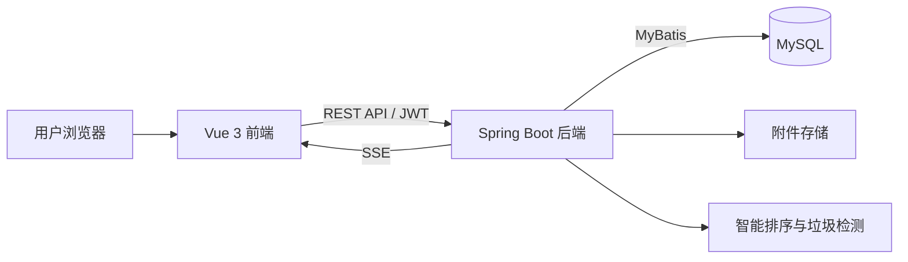
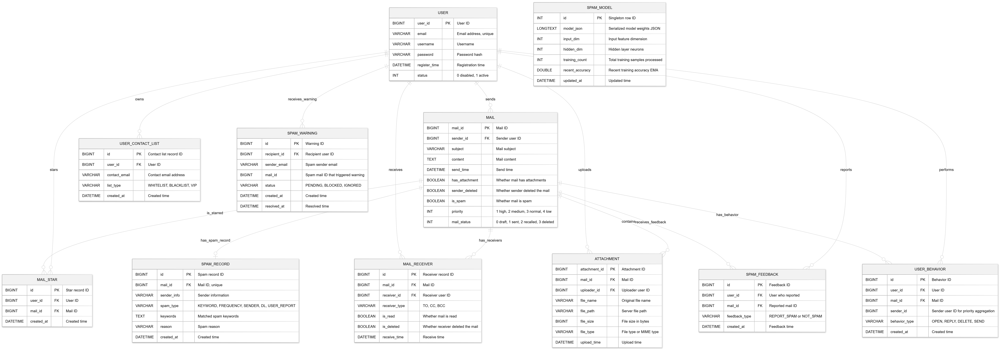

# 智能邮件管理系统

一个基于 Java 17、Spring Boot 与 Vue 3 构建的前后端分离邮件管理系统，覆盖用户认证、邮件管理、附件、搜索筛选、智能排序、实时通知与垃圾邮件检测等场景。

> 本仓库仅用于实习求职中的项目成果展示。完整源码、运行配置和原提交历史不公开，仓库内不包含密码、Token、API Key 或真实用户数据。

## 项目概览

| 项目 | 内容 |
|---|---|
| 项目类型 | 团队协作项目 |
| 后端 | Java 17、Spring Boot 2.7、MyBatis、MyBatis-Plus、JWT |
| 前端 | Vue 3、Vue Router、Vite、Axios |
| 数据库 | MySQL |
| 协作工具 | Git、GitHub、Postman |
| 本人主要参与 | 数据库设计、后端接口开发与联调、Git 协作 |

## 功能模块

- 用户注册、登录、退出与 JWT 身份认证
- 收件箱、已发送、垃圾箱、邮件详情、删除与恢复
- 按关键词、状态和附件条件搜索邮件
- 附件上传、下载与邮件附件查询
- 基于邮件内容、联系人关系和行为信号的智能排序
- 未读邮件查询与 SSE 实时通知
- 结合关键词、发送频率、黑名单和账号风险的垃圾邮件检测

## 系统架构

系统采用前后端分离架构。前端负责页面交互和状态展示，后端统一处理认证、业务逻辑与数据访问，数据库保存用户、邮件、附件及风控相关数据。

## 我的主要贡献

- 参与需求梳理及数据库表结构设计，完成核心实体关系分析与 E-R 建模。
- 参与后端 RESTful API 的设计、开发和前后端联调。
- 使用 MyBatis 完成部分数据访问逻辑与 SQL 编写。
- 使用 Git 进行分支协作、代码合并和问题修复。
- 主动查阅技术文档并学习项目所需的新知识，通过接口测试和日志定位解决联调问题。

更完整的个人贡献说明见 [docs/my-contribution.md](docs/my-contribution.md)。

## 技术要点

### JWT 身份认证

登录成功后由后端签发 JWT，前端请求时通过 `Authorization: Bearer <token>` 传递身份信息，后端统一完成认证校验。

### 邮件搜索与状态管理

围绕收件箱、已发送、垃圾箱、已读状态和附件条件设计查询接口，并通过统一响应结构降低前后端联调成本。

### 实时通知

后端使用 SSE 向前端推送未读邮件通知，前端负责连接管理、消息更新与异常清理。

### 垃圾邮件检测

综合关键词、发送频率、黑名单及账号风险等信号进行判断，并记录检测结果供后续查询。

## 项目资料

- [项目设计与功能说明](docs/project-overview.md)
- [我的个人贡献](docs/my-contribution.md)
- [数据库 E-R 图](assets/E-R_diagram.png)

## 数据库设计

## 公开说明

本项目由团队共同完成。为保护团队成果和敏感配置，本展示仓库不提供完整源码，只展示经过整理和脱敏的项目架构、功能说明、数据库设计及个人贡献。面试时可进一步说明模块设计、接口流程和问题解决过程。
