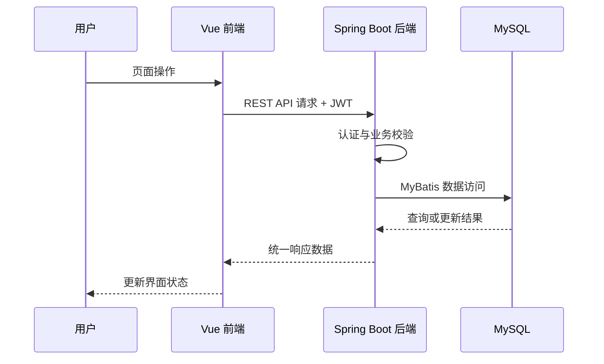

# 项目设计与功能说明

## 项目背景

本项目面向常见邮件管理场景，目标是在统一界面中完成账号认证、邮件收发、状态管理、附件处理、搜索筛选和智能辅助。项目采用前后端分离架构，由数据库、后端和前端三个部分协同完成。

## 架构设计

## 模块说明

| 模块 | 主要职责 |
|---|---|
| 用户认证 | 注册、登录、退出、当前用户查询与 JWT 校验 |
| 邮件管理 | 发件、收件箱、已发送、垃圾箱、详情、删除、恢复及已读状态 |
| 搜索筛选 | 按关键词、状态和附件等条件查询邮件 |
| 附件管理 | 附件上传、下载以及按邮件查询附件 |
| 智能排序 | 结合星标、行为、内容、联系人关系和时间等信号计算优先级 |
| 实时通知 | 查询未读邮件并通过 SSE 推送新消息通知 |
| 垃圾检测 | 基于关键词、发送频率、黑名单和账号风险进行综合判断 |

## 数据库设计

数据库围绕用户、邮件、收件关系、附件、联系人、黑名单、垃圾检测记录和通知等实体进行建模。设计时重点考虑：

- 区分邮件主体与用户收件状态，支持同一封邮件对应多个接收方。
- 保留已读、删除、垃圾箱等用户维度状态。
- 通过外键和必要索引维护数据关系并提高常用查询效率。
- 将附件和垃圾检测记录拆分为独立实体，降低核心邮件表复杂度。

数据库关系图见 [E-R_diagram.png](../assets/E-R_diagram.png)。

## 接口与联调

后端接口统一使用 RESTful 风格和统一响应结构。前端通过 Axios 封装请求，在登录后自动携带 JWT。联调过程中主要通过接口测试、浏览器网络请求和后端日志确认参数、状态码及数据格式。

## 工程实践

- 使用 Git 分支完成多人协作和功能合并。
- 按模块划分前后端目录，降低不同职责之间的耦合。
- 将本地密码、密钥和 Token 视为运行配置，不在展示仓库中保存。
- 本仓库仅保留脱敏后的说明材料，不继承原项目的完整提交历史。
